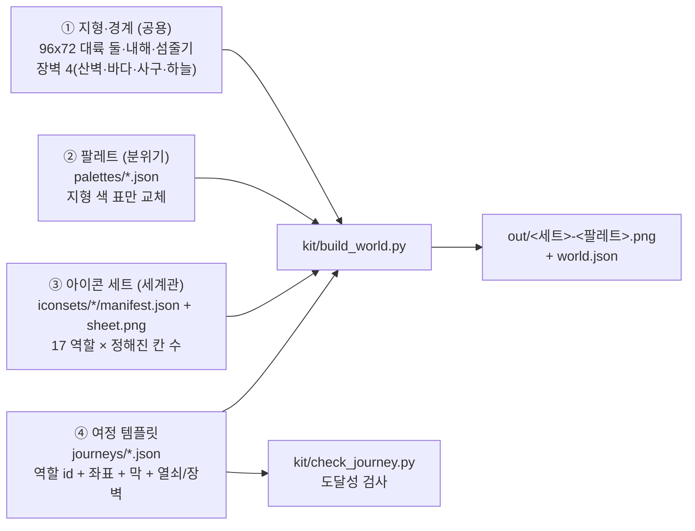

# 월드맵 키트

월드맵 설계 데모 v9 가 한 장짜리(지형 + 팔레트 + 아이콘 + 여정이 한 파이프라인에 섞인 것)였던 것을 **세계관마다 갈아끼울 수 있게** 4층으로 갈랐다.
같은 지형 위에서 팔레트(분위기)·아이콘 세트(세계관)·여정 템플릿(이야기)을 따로 고른다.



| 층 | 바꾸는 것 | 안 바꾸는 것 | 어디 |
|---|---|---|---|
| ① 지형(공용) | — (모든 조합이 공유) | 땅·물·산·길·절벽 모양, 장벽 | `kit/lib/` |
| ② 팔레트 | 지형 픽셀의 색(role 별 램프·빛) | 모양, 아이콘(틴트 0.25 만큼만 빛) | `palettes/` |
| ③ 아이콘 세트 | 장소 그림(역할별 변형) | 칸 수(역할이 정한다) | `iconsets/<id>/` |
| ④ 여정 템플릿 | 어느 역할을 어디에 두고 어느 막에 넣을지, 열쇠·장벽 | 아이콘 그림 | `journeys/` |

## 폴더 규약

```
tiledata/worldmap-kit/
  ATTRIBUTION.md              출처·라이선스(CC BY 4.0, EasyRPG RTP World 파생)
  kit/
    roles.json                17 역할(id·칸 수) + fantasy 레거시 아이콘 매핑
    build_world.py            빌더
    check_journey.py          여정 도달성 검사
    selftest.py               자체 검사(화소 동일·보고 동일·입력 오류)
    lib/                      지형 파이프라인 사본(v9-final3) + kit_common/kit_world/kit_palette
    assets/world-plus.png     지형 도트 시트(EasyRPG World 수정본)
    ref/                      selftest 기준(design-1x-final3.png·map-v9-final3.json·journey-check-final3.txt)
    tools/                    한 번 돌린 변환 기록(fantasy 자산·문서 표 생성)
  iconsets/fantasy/           manifest.json + sheet.png   ← 다른 세트는 같은 이름 규약으로 옆에 둔다
  palettes/                   original ruin dusk winter ashfall regional + 세계관 팔레트(alien gothic industrial north eastasia wuxia classical primeval desert desert-east)
  themes/                     세계관 테마 17개 — 아이콘 세트 + 팔레트 + 지형 덧칠(kit/lib/kit_theme.py)
  journeys/fantasy-5act.json
  docs/                       이 문서 · role-mapping.md · palette-schema.md
  out/                        fantasy-<팔레트>.png ×6 · world.json · build-report.json · journey-check.txt
```

## ① 역할 표 (17개, `kit/roles.json`)

아이콘 세트는 이 17개 역할을 **이 칸 수대로** 채운다. 지형은 장소 발자국(칸 수)에 맞춰 만들어지므로 칸 수가 다르면 땅이 어긋난다 — 빌더가 시작할 때 거절한다.

| id | 칸 | id | 칸 | id | 칸 |
|---|---|---|---|---|---|
| `capital` | 6x6 | `large_town` | 3x3 | `ruin` | 2x2 |
| `fort_city` | 4x4 | `village` | 2x2 | `ruin_city` | 4x3 |
| `harbor_city` | 5x4 | `camp` | 2x2 | `shrine` | 3x3 |
| `castle` | 3x3 | `tower_small` | 1x2 | `landmark_nature` | 3x3 |
| `circle` | 2x2 | `tower_great` | 2x4 | `volcano` | 2x2 |
| `floating` | 5x4 | `cave` | 2x2 | | |

fantasy 의 38 아이콘이 어느 역할에 들어갔는지, 칸 수가 안 맞는 것(`castle_dark_grand` 5x5 하나)은 `role-mapping.md`. 역할 `floating` 은 정확히 한 장소(천공섬)여야 하고, 아이콘 밑에 바다 그림자가 진다.

## ② 아이콘 세트 `iconsets/<id>/manifest.json`

```json
{
  "id": "fantasy",                       // 폴더 이름과 같아야 한다
  "name": "판타지 (기본)",
  "tile": 16,                            // 16 만 지원
  "key": [255, 103, 139],                // 투명 키색
  "shadow_key": [254, 103, 139],         // 선택. 이 화소 밑의 지형을 어둡게(바닥 그림자). 지금은 이 값만 지원
  "sheet": "sheet.png",                  // RGB 시트. 칸 좌표 (col,row) × 16px
  "extra_colors": ["1a2b3c", "..."],     // 원본 EasyRPG World 칩셋 팔레트에 없는 색(출처 점검용, 빌더는 읽지 않는다)
  "icons": [
    { "role": "village", "name": "village_wood", "cells": [2, 2], "col": 17, "row": 0, "desc": "촌락 — 목조 집 세 채" }
  ],
  "pins": { "강가 마을": "windmill_farm" },   // 선택. 장소 id → 아이콘 이름 고정(없는 장소는 해시로 고른다)
  "license": "CC BY 4.0 — ..."
}
```

- 아이콘은 역할마다 **여럿**이어도 된다(변형). 장소에는 `pins[장소 id]` 가 있으면 그것, 없으면 **역할의 칸 수가 맞는 변형 중 `crc32(장소 id) % 변형 수`** 로 고른다(같은 입력이면 항상 같다, 실행마다 안 변한다).
- `pins` 는 세계관 세트가 장소별 손 배정을 고정하고 싶을 때만 쓴다. fantasy 는 원래 한 장짜리의 배정을 그대로 고정했다(그래서 화소 동일).
- 아이콘 안: 키색 = 투명, 그림자 키 = 밑 지형 어둡게(눈 같은 밝은 바닥에서는 가장자리를 디더로 줄여 사각 판이 안 튄다), 나머지는 그림.
- 아이콘 이름·좌표가 겹치거나 시트 밖이면 거절한다.

## ③ 팔레트 `palettes/<id>.json`

`palette-schema.md`. 요점: 지형 그림의 색마다 role(어느 칸 종류에서 나왔나)을 자동으로 정하고, 팔레트는 role 별 램프·빛만 적는다. 지형 종류마다 램프를 따로 두면 명암 3단 이상이 유지된다.

## ④ 여정 템플릿 `journeys/<id>.json` (`worldmap-journey/1`)

```text
id, name, desc, terrain                 terrain = 어느 공용 지형 위인가 (지금은 shared-v9 하나)
acts[]        { id, name, means, color }              막 5개(막 k 의 수단 = means)
means{}       pass|ship|skiff|air → { name, source(수단을 얻는 장소 id), barrier, act }
barriers[]    { id, name, means, gate, desc }          장벽 4종: mount_wall(통행증)·sea(범선)·dune_sea(사막선)·sky(비공정). gate = 그 장벽을 여는 문/출발 장소
start         { place, cell:[x,y] }                    시작 칸(강가 마을 한가운데)
final         최종 장소 id (천공섬)
places[]      { id, role, x, y, ground, kind, act, function, story, note, seq }
                role   역할 id (아이콘 id 는 쓰지 않는다)
                x, y   발자국 왼쪽 위 칸(칸 수는 역할이 정한다)
                ground 발자국 밑 바닥(terrain_v4 상수 이름: GRASS SNOW SAND …, null = 그대로)
                act    처음 닿는 막(0~4) — 도달성 검사가 지도 BFS 와 대조한다
                function 시작|거점|관문|장벽 해제 열쇠|위기|보상|선택 탐험|최종    seq 줄거리 순서(검사 보고의 정렬용)
roads[]       { id, from, to, via }                    장소(또는 지형의 경사로) 사이 길. 배열 순서가 길 계획 순서다
terrain_nodes { ramps[] }                              roads 끝점으로 쓸 수 있는 공용 지형의 경사로 4개
main_line[] { place, event } · leg_stage[] · entries{ship,skiff} · checks{must_not_walk, opening_must_see, opening_far} · crisis[]
```

**지형에 묶인 것(주의)**: `places[].id` 중 `내해 항구`·`고갯길 요새`·`사막 신전`·`사막 폐허`·`설원 마을` 과 roads 의 끝점, `start.cell`, 천공섬 좌표는 공용 지형 코드(경사로·사구 후처리·관문·항구)가 **이름과 좌표로 직접 참조**한다.
다른 이야기를 올리려면 같은 지형 위에서 `role`·`act`·`story`·`function`·수단 배치를 바꾸는 것이 안전하고, 표시 이름을 바꾸려면 새 필드를 두고 id 는 그대로 둬야 한다. 지형 자체를 바꾸는 것은 이 키트의 범위 밖이다(`kit/lib/terrain_*`).

## 빌더 `kit/build_world.py`

```bash
python3 kit/build_world.py --iconset fantasy --palette all --journey fantasy-5act --out tiledata/worldmap-kit/out --cache /tmp/wmk-cache
python3 kit/build_world.py --theme steampunk --journey fantasy-5act --out /tmp/wm --cache /tmp/wmk-cache   # 테마 = 세트·팔레트·덧칠을 한 번에
#   --palette original | winter,dusk | all    --tint-icons 0.4    --no-check    --cache <dir>
```

1. 세트·템플릿·팔레트를 읽고 **검사**한다: 템플릿의 모든 역할을 세트가 칸 수대로 채우는가(모자란 것 전부), pins 가 맞는가, 팔레트 키가 맞는가. 틀리면 `입력 오류:` 로 **무엇이 모자란지 적고 종료 코드 2**.
2. 공용 지형을 아이콘 없이 끝까지 그린다(약 100초, 한 번). `--cache` 는 지형과 색→role 표를 저장한다 — 키는 템플릿 + 역할 표 + 지형 코드라서 **아이콘 그림이 달라도(칸 수가 같으면) 같은 캐시를 쓴다**.
3. 팔레트마다: 지형 색 교체 → 아이콘 붙이기(`--tint-icons` 만큼 팔레트 빛; 기본 0.25, 팔레트의 `icon_tint` 가 있으면 그 값) → `<out>/<세트>-<팔레트>.png`.
4. `world.json` : 지형 배열(ground/object/height_level/ramp/face)·길·다리·장소(역할·아이콘·좌표·막)·팔레트 id·사용한 아이콘·이미지 파일. `build-report.json` : 지표. `journey-check.txt` : 도달성 보고.

## 여정 검사 `kit/check_journey.py`

```bash
python3 kit/check_journey.py --journey fantasy-5act --iconset fantasy          # 템플릿대로 지형을 만들어(약 2초) 검사
python3 kit/check_journey.py --journey fantasy-5act --map out/world.json       # 출력한 world.json 의 지형으로 검사
```
통행 판정은 지도 칸 위에서: 걷기(산·절벽·강·협곡·바다·사구 막힘, 다리·경사로·발자국 열림) · 관문(통행증) · 배(항구에서 타고 높이 0 해안에서 내림) · 사막선(+사구) · 비공정(천공섬 발판).
막별 도달 영역을 BFS 로 구해 `places[].act` 와 대조하고, 수단을 얻는 장소의 순서, 장벽 두께, 시작 화면, 줄거리 선, 길이 장벽을 가로지르지 않는지를 본다. 종료 코드 0 통과 / 1 불일치 / 2 입력 오류.

## 자체 검사 `kit/selftest.py`

fantasy + original + fantasy-5act 가 v9-final3 의 `design-1x-final3.png` 와 **화소 단위로 같은지**, `world.json` 의 지형이 `map-v9-final3.json` 과 같은지, `world.json` 으로 돌린 도달성 보고가 `journey-check-final3.txt` 와 글자 단위로 같은지,
pins 없이 해시로 고른 결과가 결정적인지, 입력 오류(역할 없음·칸 수 틀림·pins 틀림·없는 팔레트·없는 여정)가 명확한 메시지와 종료 코드 2 로 거절되는지를 확인한다.

## 새 세계관 아이콘 세트를 추가하는 절차

1. `iconsets/<새 id>/` 를 만든다(폴더 이름 = manifest 의 id).
2. 역할 **17개를 칸 수대로** 채운 `sheet.png`(RGB, 16px 격자, 키색 배경)를 그린다. 역할마다 변형을 여럿 넣어도 된다. 다른 세계관이면 `village` 한 역할에 변형이 가장 많이 필요하다(기후·문화별).
   `roles.json` 의 `legacy_fantasy` 와 `role-mapping.md` 가 칸 수와 예(어떤 그림이 어느 역할)를 보여 준다. 키색 `(255,103,139)` 은 투명, `(254,103,139)` 은 밑 지형을 어둡게 하는 그림자.
3. `manifest.json` 을 위 스키마로 쓴다(`role`·`name`·`cells`·`col`·`row`·`desc`).
4. 검사: `python3 kit/check_journey.py --journey fantasy-5act --iconset <새 id>` — 역할이 비면 무엇이 비었는지 다 나온다. 폴더를 저장소에 넣기 전에는 `--iconset /임시/경로/<id>`(실제 폴더 경로)로 시험할 수 있다.
5. 빌드: `python3 kit/build_world.py --iconset <새 id> --palette all --journey fantasy-5act --out /tmp/x --cache /tmp/wmk-cache` 후 **PNG 를 직접 열어** 아이콘이 팔레트에서 묻히지 않는지, 장소 발자국 둘레에 사각 패치가 안 보이는지 본다.
6. 출처를 `ATTRIBUTION.md` 에 더한다(EasyRPG World 칩셋의 팔레트·결을 따른 손 도트면 CC BY 4.0 파생물). 생성 이미지·트레이싱은 쓰지 않는다.

## 제품 등록: 생성 지도와 사람 선택 스탬프 (2026-10-04)

지형은 경계를 넘는 픽셀 후처리가 있는 래스터 파이프라인이다. `edit_world_terrain`은 결과 PNG를 프로젝트 타일셋에 16px 칸으로 등록하고 통행 표를 저장한다.
이 지형을 재사용 가능한 오토타일 부품 시트로 환원하는 일은 별도다.

사람이 선택한 아이콘은 이제 `worldmap-icons build/check`로 공용 `worldmap_selected`에 굽는다(79개·1,620칸).
기존 EasyRPG 지형 480칸 뒤에 고정 칸 번호로 붙이며, 미선택267개는 넣지 않는다.
원본 사본·선택/그림 해시·칸 배열·참고문서·실제 비교 그림은 `selected/`와 공용 번들 JSON에 있다.
OPRN 조수는 `list_worldmap_icons → 참고문서 읽기 → stamp_worldmap_icon → inspect_worldmap_icon`으로 생성 지도에도 이식한다.
새 프로젝트와 기존 SQLite 프로젝트 모두에서 저장·재로드했다. 자세한 계약은 `src/harnesses/worldmap-icons/README.md`.

## 다음 단계 제안

1. ~~다른 세계관 세트 둘~~ — **완료(2026-10-01).** `iconsets/desert-east`(사막·동양풍) · `iconsets/modern-sf`(현대·SF) 가 17 역할을 칸 수대로 채우고,
   `python3 kit/build_world.py --iconset <세트> --palette original --journey fantasy-5act --out <dir>` 가 둘 다 입력 검사·여정 검사를 통과한다.
   같은 지형·같은 여정에서 아이콘만 바뀐 비교 그림은 `docs/sets-desert-east-modern-sf.png`. 남은 것: 세트 둘을 6팔레트 전부로 돌린 비교(`--palette all`)는 아직 안 했다.
2. **여정 템플릿을 하나 더**(예: 3막 단순형) — 같은 지형에서 이야기만 바꿔 `check_journey` 가 막 구분을 다시 증명하는지 본다. 지형에 묶인 이름·좌표(위 주의)를 풀어 `role` 로 참조하는 쪽으로 지형 코드를 일반화하는 것이 다음 큰 일이다.
3. **팔레트를 지형 코드 쪽으로 내리기**: 지금은 렌더가 끝난 픽셀의 색을 role 로 거꾸로 센다(순도 0.845). 지형 모듈이 칸 종류별 색 표를 직접 읽게 바꾸면 role 경계가 칸 단위로 정확해지고 `regional` 같은 지역 팔레트가 쉬워진다.
4. **제품 등록 — 일부러 하지 않았다.** 제품 번들의 `atlas_biome_world` 는 **타일 번호 시트**(칸을 맵에 칠하는 방식)이고, 이 키트는 완성 그림에 래스터 아이콘을 붙이는 **렌더 파이프라인**이라 모양이 다르다.
   억지로 맞추려면 (a) 지형을 오토타일 시트로 바꾸거나 (b) 아이콘을 `stamp_tileset_object` 류 오브젝트 조각으로 등록해야 한다. 먼저 지형 오토타일 시트화의 범위를 재는 작은 시험(바닥 3종 + 바다)부터.

## 아이콘 세트의 현재 상태 (2026-10-02)
경사 투영 렌더러로 그린 아이콘(사막·동양풍 · 현대·SF 전부, 판타지의 화염 요새·폐허 일부)은 **옆면이 보이는 아이소메트릭 시점**이라 칩셋 규약(윗면 + 정면 벽)과 어긋난다.
세 세트 82장 전부를 월드맵 아이콘 하네스(`src/harnesses/worldmap-icons/`)에 올렸다. 사용자의 받기/버리기가 `harness-data/worldmap-icons/decisions.json` 에 모이기 전에는 어떤 아이콘도 「확정」이 아니다.


## 세계관 세트 14개 추가 (2026-10-02) — 3D 장면 + 정면 카메라

사용자가 1~3차(테마 14개)를 지시해 세트 14개 262장을 더했다. 모두 `iconsets/_scene3d/` 공용 렌더러로 찍었고 생성 이미지·트레이싱은 없다.

| 세트 id | 이름 | 장 | 비고 |
|---|---|---|---|
| fantasy-dungeons | 판타지 던전·신전 입구 | 12 | 부분 세트 `extends: fantasy` |
| monster | 몬스터 수집 | 19 | |
| joseon | 조선 | 19 | |
| sengoku | 일본 전국 | 20 | |
| wuxia | 무협 중국 | 19 | |
| classical | 고대 그리스·로마 | 20 | |
| dark-gothic | 다크 판타지·고딕(위처풍) | 20 | |
| snow-north | 설원·북방 | 19 | |
| sea-isles | 바다·군도 | 20 | |
| prehistoric | 선사·원시 | 19 | |
| steampunk | 스팀펑크·마도 | 20 | |
| modern-town | 현대 소도시 | 19 | |
| alien | 외계 행성 | 19 | |
| starmap | 성계 지도 | 19 | `kind: space` — 땅 대신 우주 배경 |

### `_scene3d` 세트 규약

- 세트 폴더에 `scenes.py`(SET·ORDER·장면 함수)와 `build.py`(`from buildset import main; main(__file__)`) 만 둔다. `python3 iconsets/<id>/build.py` 가 `sheet.png`·`manifest.json`·`preview/`·`build-report.json` 을 다시 만든다.
- **카메라는 정면 3/4**: KX=0(동·서 옆벽 0px), KY=.62, 빛은 원래(왼쪽 위). 장면은 처음부터 정면용으로 짓는다(뒤 건물은 좌우로 엇갈리게).
- 장면에 땅 받침(풀·흙 판)을 깔지 않는다 — 지형이 바닥이다. 칸을 넘치면 빌드가 실패로 적는다.
- 새 색은 세트마다 24개까지(`max_new_colors`). 나머지는 EasyRPG World.png 색.
- `extends: <바탕 세트>`: 부분 세트. 자기 아이콘만 시트에 두고 나머지 역할은 바탕 세트에서 빌린다(`kit_common.IconSet`, 빌린 아이콘은 `_own=False`). `SET['partial']=True` 면 17역할 검사를 건너뛴다.
- `kind: space`: 하네스가 지형 대신 별 바탕(`render.starfield`)에 붙인다. 우주 지형층(성운·소행성대·항로)은 아직 없다.

### 검수 규칙

정면 카메라 세트(manifest `camera.kx == 0`)는 하네스가 `FRONT3D_RULE` 을 검수 지시에 넣는다. 첫 검수에서 FAIL 의 대부분(147건)이 `SIDE` 였는데,
원통·원뿔·모임지붕 끝의 오른쪽 명암을 옆면으로 읽은 것이었다(평평한 옆벽은 시선과 직각이라 0px). 규칙을 넣은 재검수는 `READ`(1배에서 안 읽힘)·`STYLE` 만 남긴다.
검수 결과는 참고일 뿐이고 받기/버리기는 사용자가 하네스(http://localhost:18313/)에서 한다.

## ⑤ 세계관 테마 `themes/<id>.json` (`worldmap-theme/1`, 2026-10-03)

팔레트는 색만 바꾼다. 현대 도시의 아스팔트, 스팀펑크의 철길, 우주의 성운은 색으로는 안 된다 — 그래서 **테마 층**을 두었다.
테마 = 아이콘 세트 + 팔레트 + 덧칠 목록. 덧칠은 팔레트를 입힌 지형 그림(아이콘 없음) 위에서 아이콘을 붙이기 전에 돈다.
지형 모양·장소 발자국·여정은 그대로라 도달성 검사 결과가 같다. 그림은 전부 `kit/lib/kit_theme.py` 안의 좌표·문자 지도 도트다(생성 이미지 없음).

```json
{ "schema": "worldmap-theme/1", "id": "steampunk", "name": "스팀펑크·마도", "iconset": "steampunk",
  "palette": "industrial", "overlays": ["rail", "sprawl:steam", "smog"], "kind": "land" }
```

| 덧칠 | 하는 일 |
|---|---|
| `paved_roads` | 흙길 → 아스팔트(연석·아래 연석 그늘·노란 가운데 점선, 전역 좌표로 이어짐). 나무 다리 → 콘크리트 다리(난간·교각·그림자) |
| `rail` | 흙길 → 철길(자갈 바닥·침목·두 레일, 갈림 칸은 판, 끝 칸은 붉은 차막이). 다리 → 트러스 철교 |
| `sprawl:modern\|sf\|steam` | 수도·요새도시·항구도시 둘레 2칸, 큰 마을 둘레 1칸을 시가지 구역으로: 구역 바닥 + 칸마다 건물(같은 건물이 왼쪽·위에 붙지 않게). steam 은 굴뚝 연기 |
| `smog` | 공업 도시 둘레를 그을음 빛으로 4단 디더(수도 8칸·도시 5.5칸) |
| `erase_roads` | 흙길을 지운다(선사). 길 칸은 가까운 같은 바닥·같은 8이웃 모양 칸의 그림을 통째로, 둘레 칸은 같은 자리 화소를 빌려 온다 — 8방향 전파로 넓게 메우면 화소가 늘어진 줄무늬가 남았다. 높이가 바뀌는 경사로(흙 비탈)는 남긴다 |
| (자동) `mend_roads` | 길을 다시 그리지 않는 테마에서 공용 지형의 한 칸 틈((17,25) 등)과 평지 경사로를 같은 바닥·같은 연결 모양의 다른 흙길 칸 그림으로 바꿔 잇는다. 계단 그림이 있는 경사로는 건드리지 않는다 — (16,29)~(15,30) 대각 틈은 그래서 남아 있다 |
| `kind: space` | 땅 대신 우주를 처음부터 그린다(아래) |

**길 다시 그리기의 함정(실측).** 옛 흙길 띠는 칸 x 4~11 에 바깥 테두리가 ±1 흔들린다. 새 띠를 칸마다 같은 자리(4~11)에 반듯하게 찍고,
옛 테두리·흙 화소는 지도 전체에서 깨끗한 화소로부터 8방향 전파(`fill_global`)로 메운다 — 칸마다 따로 메우면 아직 안 지운 옆 칸 흙을 베껴 왔다.
장소 쪽 팔은 「옛 길 흔적이 그 가장자리 4줄에 있는가」(`_entered`)로만, 그리고 길이 거기서 끝나는 칸에서만 낸다 — 아니면 장소 옆을 지나는 길마다 빗살 팔이 돋는다.
장소 = 실제 발자국(`occupied`)이다. `world.foot_cells` 에는 장소 밖 길 칸도 섞여 있어 그것을 장소로 치면 선로가 경사로 앞에서 끊긴다.

**우주(`render_space`).** 칸 배열을 그대로 읽어 같은 장벽 자리를 지킨다.
- 성운 = 밀도장: 휜 좌표(±12px/28px + ±4px/9px)로 읽은 땅 마스크를 흐려 밀도를 얻는다. 안쪽은 노이즈로 4단 밝기와 빈 구멍, 바깥은 2~3칸에 걸쳐 옅어지며 가스 실이 뻗는다.
  색은 가장 가까운 땅의 바닥 종류(10종, 사막 = 호박·금빛, 늪 = 청록). 3x3 다수결 2번 + 6칸 미만 덩이 흡수로 밭·강 조각 네모를 지운다.
- 산·절벽 = 소행성대(먼지 띠 + 6가지 배치), 화산 = 2칸 안쪽 무리마다 붉은 거성 하나(크기 3단 + 빛무리), 숲 = 성단(빛무리 + 십자 별), 사구 바다 = 보라 이온 폭풍(비치는 막 + 줄무늬 + 갈래 번개).
- 길 = 초공간 항로(1px + 2px 빛무리, 꺾임은 4분원, 막다른 끝은 7px 마름모 표지). `lane_graph` 하나를 땅 길·철길·항로가 같이 쓴다: 길 칸 + 경사로 칸(2x2 덩이·막다른 순수 경사로는 걷는다) + 한 칸 곧은 틈·대각 틈 메우기. 다리 줄 = 워프 구간(검은 균열 + 점선 + 줄 양끝 금색 고리).
- 장소 밑은 둥근 어둠(타원, 2단 디더)으로 눌러 아이콘이 성운에 묻히지 않게 한다. 발자국 네모로 누르면 1배에서 네모 구멍으로 보였다.

캐시 서명에서 `kit_theme`·`kit_palette`·`kit_common` 은 뺀다(지형에 영향이 없다) — 덧칠을 고칠 때마다 100초 지형 렌더를 다시 하지 않는다.
하네스(`src/harnesses/worldmap-icons/render.py` `themed_terrain`)도 같은 테마로 지도 자리 그림을 만든다.

### 세계관 팔레트 배정 (2026-10-03, 적대적 시각 QA 3회 뒤)

| 테마 | 팔레트 | 테마 | 팔레트 |
|---|---|---|---|
| fantasy · fantasy-dungeons · modern-* · starmap | original | joseon | joseon(소나무 청록·황토) |
| sengoku | sengoku(삼나무·청록 논·검은 화산토) | wuxia | wuxia(수묵 산·옥빛 초원) |
| classical | classical(올리브·에게해) | dark-gothic | gothic(색상을 나눈 잿빛) |
| snow-north | north(사막→빙원 청백) | desert-east | desert-east(동대륙·남쪽으로 번지는 사막) |
| monster | bright(밝고 선명) | sea-isles | tropic(열대 청록·흰 모래) |
| prehistoric | primeval | alien | alien |
| steampunk | industrial | | |

후속 상태(2026-10-04): 계단 늪·직선 하구는 아래 ⑧ 지형 경계 v9에서 고쳤다. 산은 여전히 반복 칩으로 그리는 양식화된 지형이다. 스팀펑크 청록 화산·보라 수정·형광 천공섬은 교정 판 r61~65를 열었다. 독립 검수를 거친 후보를 사람이 고르기 전에는 시트·게임에 넣지 않는다. 색 교정 지시는 재작성 검수에도 전달하며, 원본 설명의 옛 색을 복원하라는 요구와 충돌하지 않게 한다.
고친 것(2026-10-03 4차): 군도는 아래 ⑥ 지형 편집으로 실제 섬나라가 됐다. 외계 길은 띠 안쪽을 길 색으로(`force_road_band`, 장소로 들어가는 막다른 팔 포함),
SF 시가지 바깥 고리는 빈 광장 42%, 성운 종류 경계는 크게 휜 좌표(±32px/46px)로 고른다.

## ⑥ 지형 편집 `terrains/<id>.json` (`worldmap-terrain/1`, 2026-10-03)

공용 지형(shared-v9) 위에 작업(ops)을 얹는다. 정본 문법은 `kit/lib/kit_terrain.py` 머리 주석.

```bash
python3 kit/build_world.py --theme sea-isles --journey fantasy-5act --out out/ --terrain archipelago        # 이름 붙은 지형
python3 kit/build_world.py --theme fantasy   --journey fantasy-5act --out out/ --terrain my.json --preview  # 칸 배열만(1~3초)
```

| 작업 | 인자 | 하는 일 |
|---|---|---|
| `land` | poly, ground? | 땅을 더한다(바다 위에도) |
| `sea` | poly | 바다로 자른다 — 대륙 가르기·만 파기. 장소가 물이 되면 오류 |
| `island` | x, y, rx, ry, ground? | 타원 섬 |
| `biome` | poly, ground | 바닥을 바꾼다 |
| `ridge` / `pass` | line, kind?, width?, peak? / x, y, r? | 산줄기 / 고개 |
| `river` | line, widen? | 강(바다로 끝낸다) |
| `forest` / `clear` | poly, kind?, density? / poly, what? | 숲 / 숲·산 걷기 |
| `plateau` | poly, level?, ground? | 고원(가장자리 절벽) |
| `volcano` | x, y, lava? | 화산 — 가운데 큰 원뿔(못 걷는다)·분화구(반지름 2.6)·화산 고리(3.6)·용암 줄기. 반지름 4칸이 땅이어야 한다 |
| `move_place` | id, x, y | 여정 장소 옮기기 |

- 다각형은 같은 노이즈로 휘어 그려 손 지형과 결이 같다. 오류는 문장으로(`KitError`): 장소가 물 위, 길을 낼 수 없음, 바다 장벽이 좁음.
- `--preview` 는 `schematic.png`·`terrain.txt`(첫 줄 범례 글자 지도)·`world.json`(walk 행 포함)·여정 검사.
- 테마의 `"terrain": "<id>"` 는 그 지형을 깔고, `--terrain` 은 그 위에 얹는다(`kit_terrain.merge`).
- 지형 서명별 캐시 `cache/terrain-<sig12>`.
- 「지형 경고」(`kit_terrain.coverage`): 숲·바닥이 덜 먹으면 이유별 칸 수(물·장소 둘레·길·산·사막·밀도), 사구는 서남 대사막 안에만 남는다, 섬이 다른 땅에 붙거나 지도 끝에 닿음, 화산 고리가 너무 작음. 번호는 `ops[i]`.
- 숲 `density` 는 다각형 안 「숲이 놓일 수 있는 칸」 중 숲 비율(노이즈 분위수). 고정 문턱이던 때는 노이즈가 낮은 자리에서 0.9 로도 거의 안 났다.
- 지형 편집으로 바닥을 정한 칸(`biome`·ground 있는 `land`·`island`)은 지역 팔레트(desert-east 등)가 덮지 않는다(`world.edit_ground` → `recolor_terrain(keep_cells)`).
- 여정 검사 실패·길 실패는 사람 말로(`kit_terrain.explain`, 막힌 길은 모두 한 번에 좌표와 함께). 장소마다 여정 규칙 한 줄(`world.place_rules`).
- 편집기 조수 도구 `read_world_terrain`·`edit_world_terrain` 이 이 경로를 쓴다 — `openwiki/worldmap-terrain-editing.md`.
- `terrains/archipelago.json`(군도): 남쪽 사막섬·북쪽 설원섬·동대륙을 해협(다리 걸친 강)으로 가르고 섬 5개를 더한다.

## ⑦ 새 대륙 구조 `base: "generate"` + 여정 자동 맞춤 (2026-10-03)

손 대륙(shared-v9) 대신 빈 판에 구조를 새로 만든다. 사용자 결정: 5막 여정(걷기 → 통행증 관문 → 배 → 사구선 → 비공정, 장소 31곳)은
**어떤 구조에든 자동으로 맞춘다** — 장소·장벽을 키트가 놓고 여정 검사는 그대로 돈다.

```bash
echo '{"schema":"worldmap-terrain/1","id":"s20","base":"generate","ops":[{"op":"continents","style":"shards","count":20,"seed":3}]}' > s20.json
python3 kit/build_world.py --theme fantasy --terrain s20.json --out out/ --preview   # 몇 초
python3 kit/build_world.py --theme fantasy --terrain s20.json --out out/             # 그림(약 1분)
```

| 파일 | 하는 일 |
|---|---|
| `kit/lib/kit_gen.py` | 구조(`continents` style: blobs · shards · ring · pangaea · archipelago · galaxy), 기후(위도·해안거리·습도 → 바닥), 산줄기·고개·강·숲·밭, 화산·사구 둘레 꾸밈 |
| `kit/lib/kit_fit.py` | 자동 맞춤: 시작 덩이를 가르는 산벽 띠(관문 하나만 구멍) · 첫 화면 창 안의 시작·관문·항구·탑 · 사구 바다(시작 쪽 먼 엽) · 2막 땅 · 천공섬 · 나머지 장소 간격 배치 · 최소 신장 트리 길 |
| `kit/lib/kit_geo.py` | 문화권 지리 구조: `peninsula`(조선 — 북쪽 대륙 띠 + 반도, 동쪽 척추, 서쪽으로 흐르는 강, 다도해, 남쪽 큰 섬, 동쪽 섬나라 호) · `river-continent`(중국·무협 — 서쪽 설산 고원, 북쪽 사막, 서→동 큰 강 둘, 사이 산맥) · `arc-islands`(전국 — 휜 본섬 + 북·남서·남 섬, 건너편 대륙 끝) · `korea`(실제 한반도·요동·만주·일본 열도 윤곽을 위·경도로 옮긴 것 — 조선 테마 기본). 땅 + 힌트 |
| `kit/lib/kit_realgeo.py` | 실제 지리 `real`: 위·경도 범위(box) 또는 지역 이름(region 20개)으로 `geo/` 의 실제 해안선·높이·산맥·사막·강·호수를 칸에 옮긴다. 무협(중국)·전국(일본) 테마 기본. 스윕 `kit/tools/sweep_real.sh`, 자료 만들기 `kit/tools/pack_geo.py`(척추·강·기후·산벽 극·사구 극) |
| `kit/lib/kit_space.py` | 우주(galaxy): 은하 핵 둘레 큰 성계 고리 + 나선팔 성계 염주. 땅 = 항행 공간, 바다 = 공허, 산 = 소행성대, 사구 = 이온 폭풍 |

- 막별 지역: A = 시작 덩이 1막 쪽, B = 산벽 너머 2막 쪽(벽 띠 두께 3칸, 관문 성만 구멍), D = A 의 먼 엽(사구 바다, 섬은 2칸 깎음),
  2막 바다 건너 땅 = 고른 바다에 닿은 다른 덩이, 하늘 = 열린 바다.
- 실패(맞춤·길·여정 검사)면 `RetryFit` → 같은 사양으로 `--fit-salt k+1` 새 프로세스(최대 6번). 쓴 번호는 world.json `layout` 에 남고
  조수 도구는 맵의 `worldmapSource.fitSalt` 로 저장해 다시 빌드해도 같은 세계가 나온다. 같은 사양 = 같은 해시(결정적).
- 명시 작업으로 맞춤을 덮는다: `wall {line, gate?}` · `dune_sea {poly}` · `sky_island {x,y}` · `move_place`(고정 핀). `land`·`sea`·`island` 는 구조에 접힌다.
- 우주 테마(`starmap`)는 `terrains/galaxy.json` + `journeys/space-5act.json`(같은 장소 id, 우주 이름표·막·수단) 이 기본. 그림은 `kit_theme.draw_galaxy`(핵 빛·팔 먼지·항성·궤도·행성).
- 디버그: `WMK_NO_RETRY=1`(재시도 끔), `--no-check`(이른 여정 검사 끔).
- 문화권 지리 구조(2026-10-03): 힌트는 `info['hint_*']` 로 나와 `kit_gen.generate` 가 꺼낸다(요약 JSON 에는 안 실린다).
  - `hint_clim` → `climate(bias=)`: 위도 범위 t0·t1 과 더할 장(temp·moist·elev). 기본 식은 옛 상수 그대로(.08 + .92·y — `1.0-.08` 로 쓰면 끝자리가 달라 저장된 세계가 움직인다).
  - `hint_spines`·`hint_rivers` → `_guides`: 땅에 맞춘 꺾은선과 비켜 갈 칸(2칸 팽창). 맞춤은 `avoid` 를 먼저 쓰고, 자리가 없으면 강만, 그래도 없으면 비키지 않는다.
    `features` 는 척추를 금지 칸에서 끊어 조각마다 산줄기, 이끌린 강은 어귀 쪽 조각만(바다에 닿아야 강), 자동 산줄기·강은 절반.
  - `hint_pole` → 산벽 극 가점(+60), `hint_dune` → 사구 바다를 그 극에서 가까운 1막 땅에. 사구가 1막 땅을 갈라 놓인 장소가 떨어지면 버린다.
    맞춤은 모든 산벽 후보에서 극 자리를 먼저 찾고(엄격), 없을 때만 늘 하던 「시작에서 먼 끝」. 관문 후보는 사구 극에서 멀수록 가점.
  - 스윕(2026-10-03, `kit/tools/sweep_generate.sh`): 9개 style × 시드 1~8 + 문화권 3종 × count 1·20 × 시드 1~3 = 90/90 통과(배치 재시도 1번).
  - 이끌린 강은 산벽을 건넌다(협곡 — 물은 못 걸으니 장벽은 그대로, 새면 여정 검사가 잡는다). 사구·장소 둘레·관문 보호 칸에서는 끊고 어귀 쪽만 남긴다.
    꺾은선이 만을 건너면 가장 긴 땅 구간을 쓴다.
- 결정성 수정(2026-10-03): `Fit._mst` 가 문자열 집합을 그대로 돌아 동률 길이의 길 순서가 프로세스마다 달랐다(같은 사양이 `PYTHONHASHSEED` 따라 다른 세계).
  이름 순서로 돌고 `aff` 도 정렬한다. 이 수정 전 생성 세계는 다시 빌드하면 바뀔 수 있다.
- 적대 QA(2026-10-03) 반영:
  - `shards` 는 깨진 판처럼 곧은 금(1.2~1.9칸)으로 가르고 시작 조각 몫을 줄였다(조각 20개 이하 20%, 그 위 28%). 둥근 군도와 구별되지 않았다.
  - `kit_gen._harmonize`: 눈·빙하가 사막·사구·화산재에 바로 붙으면 사이를 툰드라/황무지로, 화산 6.5칸 안 얼음은 녹이고, 한 칸 점은 이웃 다수로.
  - 천공섬 자리: 발자국 전체에서 땅까지 거리 + 둘레 땅 비율(내해·해협 벌점) + 지도 끝 5칸 금지.
  - 은하 그림: 핵에서 로그 나선 팔(별빛 띠), 넓은 팽대부, 성운 안 검은 구멍·푸른 테 약하게, 항로는 칸 계단 대신 차이킨 곡선.

## ⑧ 지형 경계 v9 (2026-10-03)

사용자 지적 「다른 타일의 경계면이 어색한 경우가 너무 많다」로 바닥·물가 경계를 다시 그렸다. `kit/lib/boundary_v9.py` 가 `render_ground` 를 맡는다.

| 무엇 | v5 까지 | v9 |
|---|---|---|
| 바닥 라벨 | σ2.4px — 16px 칸 계단이 남음 | 칸 지시 장 σ7px + 바닥별 노이즈 3단 + 라벨 장 전체 큰 결 왜곡(±8px, 60px 파장 — 긴 곧은 띠 휨), 근처에 없는 바닥은 못 이김, 부스러기(40px 미만) 지움, 한 칸 바닥은 가운데 원으로 살림 |
| 쌍 경계 | 우선순위 높은 쪽(광물)에 어두운 테두리 일괄 → 평지가 절벽처럼 | 식생↔식생·광물↔광물 덩이 디더, 광물 위 풀 술, 눈 그늘·눈가루, 밭 울타리, 구덩이(분화구·협곡)만 테두리. 두 질감의 색만 섞는다 |
| 질감 반복 | 16px 타일 하나 | 칸마다 뒤집기(방향 무늬는 좌우만, 독 늪은 안 함) + 거시 명암(같은 질감 색) |
| 강·용암·독 | 칸 오토타일(직각 계단·네모 연못) | `coast_v6.soften_inland`: 물 칸 안에서만 매끈한 장으로 깎는다(밭·나무로 안 번짐), 폭은 노이즈로 굽이마다 다르고, 물가 빛 띠 2줄. 강 어귀는 바다 물빛과 8px 디더, 강둑 선은 해안 3px 앞에서 끝. 깎인 자리는 경계 너머 거울 픽셀로 메움(줄무늬 없음) |
| 물가 띠 | 모든 바닥 같은 모래 | 바닥별(설원 얼음·늪 진흙·협곡토/재/현무암 바위·툰드라 자갈) |
| 사구 능선·늪 | 칸 직선 능선, 늪은 자기 윤곽 | 둘 다 v9 라벨(`M._label_px`)을 따른다. 능선은 고원·절벽 곁엔 안 두른다 |
| 숲 가장자리 | 0~3px 고정 | 저주파 노이즈로 -3~+6px 출렁임 |

- 경계 도감: `python3 kit/tools/boundary_atlas.py --world out/world.json --after out/x.png [--before old.png] --out atlas.png` — 지도에 있는 바닥 쌍마다 경계 한 곳을 4배로. 적대적 시각 QA 의 입력.
- `kit/ref/design-1x-final3.png` 는 이 변경으로 갱신했다(칸 배열·여정 보고는 그대로). 역할 순도 0.845 → 0.843(팔레트 재색 영향 없음).
- `boundary_v5.vnoise` 는 격자점에서만 해시한다(값 비트 동일, 6배 빠름) — 지형 렌더 약 100초 → 55초.
